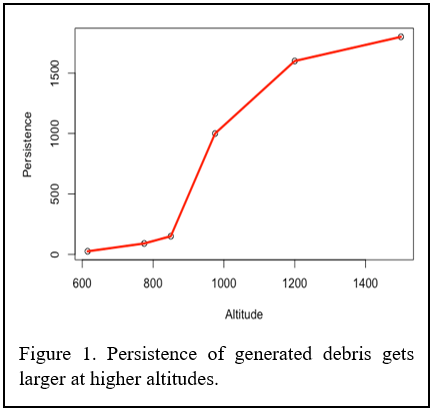
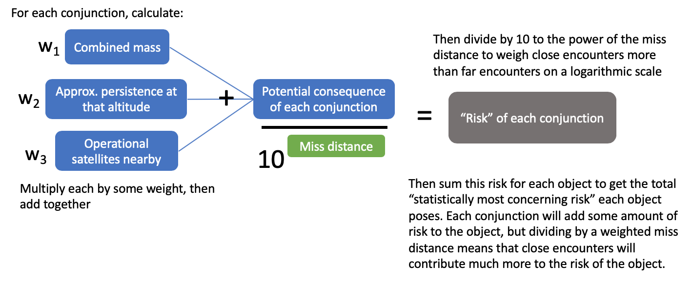

```{r include=F}
knitr::opts_chunk$set(echo=F)
knitr::opts_chunk$set(warning=F)
knitr::opts_chunk$set(message=F)

setwd("C:/Users/Harri/OneDrive/Documents/centauri/conjunction_analysis/")
library(tidyverse)
library(readr)
library(kableExtra)
library(knitr)
library(lubridate)
library(DT)
library(RColorBrewer)
library(stringr)
library(scales)
Sys.setenv(TZ='EST')
mcma_objs = readRDS("RDSfiles/mcma_objs")
all_conjs = readRDS("RDSfiles/all_conjs")
all_conjs_expanded = readRDS("RDSfiles/all_conjs_expanded")
derelicts = readRDS("RDSfiles/derelicts")
derelictDat = readRDS("RDSfiles/derelictDatNew")
alt_bins = readRDS("RDSfiles/alt_bins")
file_list = readRDS("RDSfiles/file_list")
all_conjs_2016 = readRDS("RDSfiles/all_conjs_2016")
today = toupper(strftime(Sys.Date(), format="%d%b%Y")) # current day
path = "C:/Users/Harri/OneDrive/Documents/centauri/conjunction_analysis/conj_data"
```
## Worst offender analysis-- Method 1

$\underline{Witner,\space US,\space North\space Carolina\space State\space University:}$ Risk posed by massive derelict objects is framed as consequence times probability. 
Consequence consists of the sum of three components: combined mass of the objects, approximate persistence of debris at the conjunction altitude, and number of operational satellites nearby. This algorithm treats these three as being of equal importance. Combined mass contributes to consequence since the amount of mass involved in a conjunction is directly proportional to the amount of debris that is expected to be produced by a collision. Persistence is based on orbital lifetime using altitude-dependent atmospheric density and coefficient of drag. The persistence function is shown in Figure 1.



If a collision occurs near where many operational satellites reside, the debris is more likely to pose a collision risk to those operational satellites. Thus, for each conjunction, the spatial density of operational satellites at that altitude is calculated and used. 
For the probability component, we consider the miss distance of each conjunction. In general, risk increases exponentially as miss distance gets smaller; however, due to the unavoidable uncertainty inherent in the use of two-line element sets (TLEs) for miss distance estimation, this trend does not hold for misses that are reported to be under ~1 km. The margin of error for the miss distances is so significant that it is not fair to conclude that a 0.05 km miss is exponentially riskier than a 0.5 km miss. 
Thus, the probability component is quantified by dividing consequence by 10 to the power of the miss distance, if miss distance is > 1km; otherwise, divide consequence by 10. For example, imagine that the consequence component of a conjunction is 300. The table to the right shows what the risk would be for various miss distances. This essentially makes conjunctions < 1 km contribute exponentially more to risk than conjunctions > 1 km, as depicted in Table 1. 


After calculating the risk of each conjunction, risk is summed over each object to get the total debris-generating risk each object poses. This results in the cumulative risk continuously increasing as the number of conjunctions (that are close and highly consequential) an object is involved in accumulates over time.


```{r top50}
x = c("cc615","cc775","cc850","cc975","cc1200","cc1500","cleo","CHIGH")

mcma_objs_risk = all_conjs_expanded %>%
  group_by(noradId) %>% 
  summarise(totalRisk = sum(risk_s)) %>%
  right_join(select(mcma_objs, -c(totalRisk, predicted_ad, DF, spatDensOpSats)), by="noradId") %>% 
  mutate(totalRisk = if_else(is.na(totalRisk), 0, totalRisk)) %>%
  arrange(desc(totalRisk))

top50 = mcma_objs_risk %>% 
  arrange(desc(totalRisk)) %>%
  head(50)

top50 = all_conjs_expanded %>%
  filter(noradId %in% top50$noradId) %>%
  group_by(noradId) %>%
  summarise(`num conjs` = n(),
            `num encounters <1 km` = length(Range[Range<1]),
            `closest approach (m)` = min(Range)*1000,
            `avg num op sats` = mean(SD),
            #`med num op sats` = median(numOpSats),
            `avg persist of conj alt` = mean(persistence)) %>% 
  right_join(top50, by="noradId")
```

Current list of top 50 objects with highest risk:
```{r view_top_50}
cols_ordered = c("noradId", "name", "cluster_new", "totalRisk", "num conjs", "closest approach (m)", "avg num op sats", "avg persist of conj alt", "num encounters <1 km", "apogee", "perigee","launch","inclination","mass","type","country")

top50 %>% dplyr::select(cols_ordered) %>%
  rename(cluster=cluster_new,
         `total risk`=totalRisk) %>%
  DT::datatable(rownames=F, extensions = c('Buttons', 'Responsive'),
                options = list( lengthMenu = c(10, 20, 30, 40, 50),
                                buttons = list(list(extend='excel',filename="worst_offenders_1", text="Download data", title=paste0("Worst offenders (method 1) as of ", today))),
                                dom = 'Bfrtip'#,
                                )) %>%
  formatRound(columns = c("closest approach (m)","avg num op sats",
  "avg persist of conj alt", "total risk"), digits=1) %>%
  formatDate(columns = "launch", method = "toDateString", params = list('en-US', list(year = 'numeric', month = 'numeric', day='numeric')
      ))
```

- `num conjs` is the total number of conjunctions (<5km) the object has been in (since 20OCT2019)
- `avg num op sats` is the average number of operational satellites within 100 km above or below each conjunction
- `avg persist of conj alt` is the average persistence (in years) of debris produced at the altitude of encounters (a rough approximation based on altitude)
- `num encounters <1 km` is the number of encounters below 1 km miss distance

### Risk among all derelicts
Among all derelicts, percent of risk accounted for by each cluster:

```{r risk_plot, fig.width=4}
totRisk = mcma_objs_risk %>% summarise(totRisk = sum(totalRisk)) %>% pull()

mcma_objs_risk %>% group_by(cluster_new) %>%
  summarise(p = sum(totalRisk)) %>% 
  mutate(p = p/totRisk*100,
         cluster_new = factor(cluster_new,
                             levels = c("cc615", "cc775", "cc850", "cc975", "cc1200", "cc1500", "cleo","CHIGH"),
                             ordered = T))%>%
  ggplot(aes(x=1, y=p, fill=cluster_new)) +
  geom_col(width = .2)+
  geom_text(position = position_stack(vjust=0.5), 
            aes(label=paste0(round(p), "%")))+
  theme_minimal()+
  theme(axis.title.x = element_blank(), axis.text = element_blank(), 
        panel.grid.major = element_blank(), panel.grid.minor = element_blank())+
  labs(fill="Cluster", y="Risk")+
  scale_fill_brewer(type = "qual")
```


